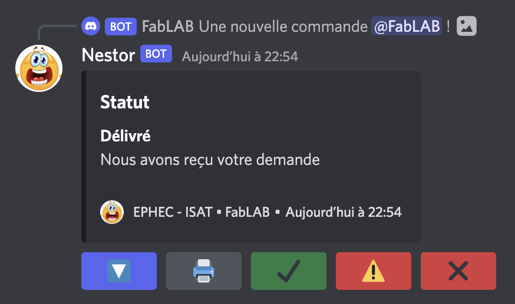

# Nestor Bot

Our school has a FabLAB containing 3D printers and this Bot will allow students to place orders from our site and track orders from Discord.

## How to Install

1. Clone this repository.
2. `npm install` for install dependencies.
3. Add the following files:

  - The `config.json` file:
  ```json
  {
    "clientId": "YOUR_CLIENT_ID",
    "guildId": "YOUR_SERVER_ID",
    "token": "YOUR_TOKEN"
  }
  ```
  - The `channels.json` and `reactions.json` files in `/data` folder. Follow the instructions [here](./data/README.md).

4. `npm start` to launch your server.

## How It Works

Before starting it is recommended to create a role for the users who manage the Bot's interactions and to define the permissions of the channel containing the Webhook.
The process works in two steps, the Webhook sending the order in the channel is the first step and the second is the Bot's response to this message with interactions described below.

### Webhook Message

When a student places an order for a 3D print, he uploads his file and chooses his filament, then he validates his order. His order is transmitted to the PHP file (Webhook) which sends a message containing the summary of his order in the Dicord channel.

### Bot Response to Webhook Message

The Bot will respond to the Webhook message with the following message:



This message contains five buttons of which here is a table showing the usefulness of each button:

| Button | Name | Utility |
|:---:|---|---|
| 🔽 | Download | Shows that the print file has been uploaded and is ready for printing. |
| 🖨 | Print | Shows that the part is being printed. |
| ✔ | Finish | Shows that the part has been successfully printed. |
| ⚠ | Default | Shows that the print had a fault. |
| ✖ | Error | Shows that there was an error either in the command (the form) or in the file or another error to be specified. |

### Add Info Using the Slash Command

The Bot contains several commands to manage the command and permissions of the Bot:

- `command-fablab`
  - `description`
  This command allows you to add a description to a command. For example add the reason for an error.
  - `temps_impression`
  This command adds the estimated print time to let the customer know when they can pick up their part.
  - `fin_impression`
  This command adds the actual print time (the time it took to print) and an optional photo to preview the printed part.
- `site-fablab`
This command sends a message with two buttons which are links to the sites to place an order.
- `help`
This command sends a message containing all the commands and their usefulness.
- `gestion-salon`
  - `ajouter-salon`
  This command adds Bot permissions to a channel. This is to limit the use of orders to authorized salons.
  - `supprimer-salon`
  This command removes the Bot's permissions to a channel.
  - `salons-list`
  This command displays all authorized channels.
- `gestion-role`
  - `ajouter-role`
  This command allows you to add a role to an emoji so that the person reacting with this specific emoji is assigned this role. It is a self-role by reaction of an emoji. To use it, you must give the ID of a message on which the Bot will react.
  - `supprimer-role`
  This command removes the self-role from a message.
  - `roles-list`
  This command displays all possible reactions (emoji and role) of a message.
- `create-embed-message`
  This command allows you to create a customizable message in Embed format.

## Getting Started Link

- [Change Log](./CHANGELOG.md): whats changed?
- [Create data files](./data/README.md): How to create data files?
- [Our order site](https;//github.io/nestor-bot/index.html): Where is our order site?

## License

Apache License

Copyright (c) 2022 Gauthier Dandele
